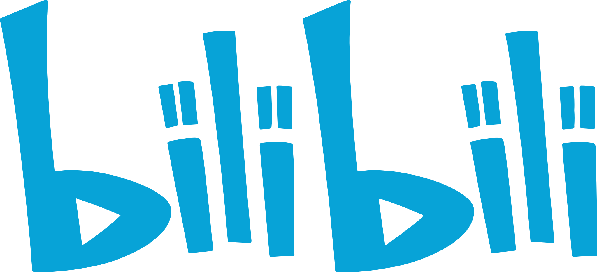

# 组织logo

`更新-260419` \| `发布-260407`

<!--  -->
<!-- |中文|英文|logo|os|wk|
|cn|en|logo|os|wk| -->

|中文|英文|logo|link|
|:---:|:---:|:---:|:---:|
|博世|bosch||[↗](https://www.bosch.com.cn/our-company/bosch-in-china/)[↘](https://en.wikipedia.org/wiki/Bosch_(company))|
|工行|icbc||[↗](https://www.icbc-ltd.com/column/1438058326469787926.html)[↘](https://en.wikipedia.org/wiki/Industrial_and_Commercial_Bank_of_China)|
|华润|crc||[↗](https://www.crc.com.cn/about/overview/Introduction/index.html)[↘](https://en.wikipedia.org/wiki/China_Resources)|
|美团|meituan||[↗](https://www.meituan.com/)[↘](https://en.wikipedia.org/wiki/Meituan)|
|太平洋保险|cpic||[↗](https://www.cpic.com.cn/aboutUs/zgtbgk/jtjj/)[↘](https://en.wikipedia.org/wiki/China_Pacific_Insurance_Company)|
|小米|xiaomi||[↗](https://www.mi.com/about)[↘](https://en.wikipedia.org/wiki/Xiaomi)|
|中建集团|cscec||[↗](https://www.cscec.com.cn/gyzj/gsjj_new/)[↘](https://en.wikipedia.org/wiki/China_State_Construction_Engineering_Corporation)|
|B站|bilibili||[↗](https://www.bilibili.com/blackboard/aboutUs.html)[↘](https://en.wikipedia.org/wiki/Bilibili)|

- 拼多多，pdd，，[↗](https://www.pinduoduo.com/home/about/)[↘](https://en.wikipedia.org/wiki/Pinduoduo)；，`260410`
<!--  -->
- 科大讯飞，iflytek，，[↗](https://www.iflytek.com/about.html)[↘](https://en.wikipedia.org/wiki/IFlytek)，`260411`
<!--  -->
- 深信服，sangfor，，[↗](https://www.sangfor.com.cn/about-us/company-profile)[↘](https://en.wikipedia.org/wiki/Sangfor_Technologies)，`260412`
<!--  -->
- 吉利，geely，，[↗](https://zgh.com/overview/)[↘](https://en.wikipedia.org/wiki/Geely)，`260417`
<!--  -->
- 招商银行，cmbchina，，[↗](https://cmbchina.com/cmbinfo/aboutcmb/)[↘](https://en.wikipedia.org/wiki/China_Merchants_Bank)，`260418`
<!--  -->
- 招商局，cmhk，，[↗](https://www.cmhk.com/main/gyzsj/jtjj)[↘](https://en.wikipedia.org/wiki/China_Merchants_Group)，`260418`
- 华润燃气，crcgas，，[↗](https://www.crcgas.com/gsjj/index.html)[↘](https://en.wikipedia.org/wiki/China_Resources_Gas)，`260419`

<!--  -->
THE END
